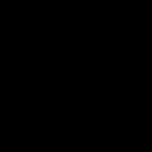

# Image Change Detection

    This repository contains the code and documentation for a Change detection project, the model achived a Jaccard Index score of 61% on unseen data, this model secured the 5th place in the competition of Cairo University Faulty of Engineering

The project uses two approaches:

- Traditional Approach
- Deep Learning Approach 

##  Table of Contents
- <a href ="#Overview">Overview</a>
- <a href ="#started"> Get Started</a>
- <a href ="#modules"> Modules</a>
- <a href ="#contributors">Contributors</a>
- <a href ="#license">License</a>

##  Project Overview 

The objective was to make a change detection model to detect changes in satellite imagery.

For example:

- No change

- Change

##  Get Started 

To get started with the project, follow these steps:

1. Clone the repository.
2. Dont froget to trun on GPU of you are using Colab or Kaggle notebook.
3. Customize the code and add any additional features as needed.
4. Run the last cell of interface and enjoy

##  Modules 

### First the Deep Learning Approach

Our approach used basically Unet plus plus model along with se_resnet101 as an encoder.

- Our approach utilized the Unet++ model architecture coupled with se_resnet101 as an encoder.
- The Unet++ architecture, known for its ability to capture complex features effectively, was chosen over the standard Unet model due to its superior performance in capturing intricate features.
- Additionally, the use of se_resnet101 as our encoder was based on recommendations from prior literature surveys.
- This selection was made to leverage the proven effectiveness of se_resnet101 in feature extraction tasks, aligning with the goals of our study.

Our data set was of

- image 1: image before change
- image 2: image after change
- mask: the change in the image

### Second the Traditional Approach

We used 2 different traditional approaches to achieve our goal of change detection.

- We used otsu's thresholding algorithm to obtain the threshold value based on intensity distribution among the pixels in the image.

The thresholding algorithm tries to get an equal number of pixels above and below its intensity.

- Image differencing + otsu as a thresholding algorithm

- CVA + otsu as a thresholding algorithm

##  Results 

<table >
<thead>
    <tr>
      <th style="text-align:center;">A</th>
      <th style="text-align:center;">B</th>
      <th style="text-align:center;">Prediction</th>
      <th style="text-align:center;">Ground Truth</th>
    </tr>
  </thead>
  <tr>
        <td align="center"> </td>
        <td align="center"> </td>
        <td align="center"> </td>
        <td align="center"> </td>
  </tr>
  <tr>
        <td align="center"> </td>
        <td align="center"> </td>
        <td align="center"> </td>
        <td align="center"> </td>
  </tr>
  <tr>
        <td align="center"> </td>
        <td align="center"> </td>
        <td align="center"> </td>
        <td align="center"> </td>
  </tr>
</table>

##  Contributors 

 
<table >
  <tr>
        <td align="center"><a href="https://github.com/Ahmed-H300"> <b>Ahmed Hany</b></a> </td>
        <td align="center"><a href="https://github.com/nouralmulhem"> <b>Nour Ziad</b></a> </td>
        <td align="center"><a href="https://github.com/EslamAsHhraf"> <b>Eslam Ashraf</b></a> </td>
        <td align="center"><a href="https://github.com/ahmedmadbouly186"> <b>Ahmed Madbouly</b></a> </td>

  </tr>
</table>

## 🔒 License 

> **Note**: This software is licensed under MIT License, See [License](https://github.com/nouralmulhem/Image-Change-Detection/blob/main/LICENSE).

